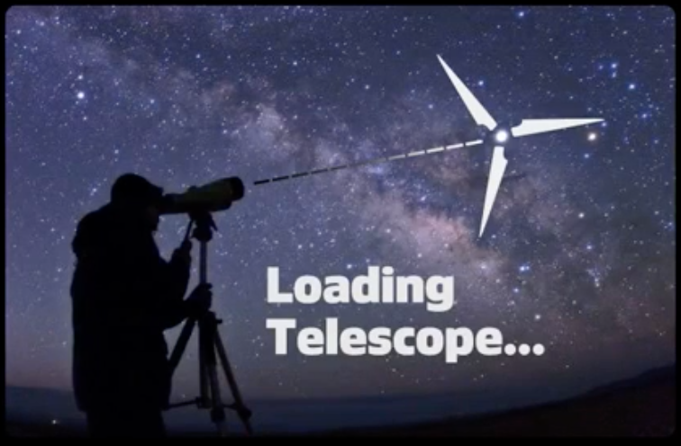
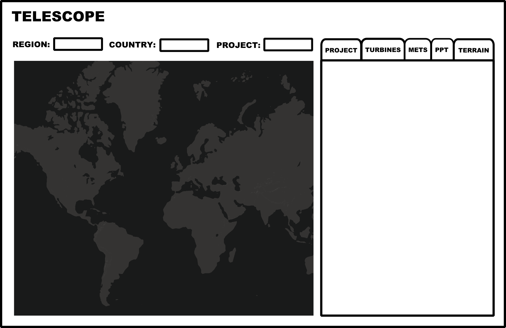
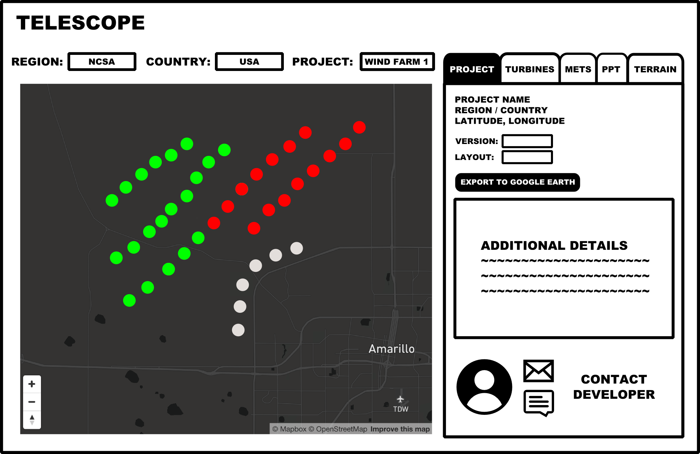
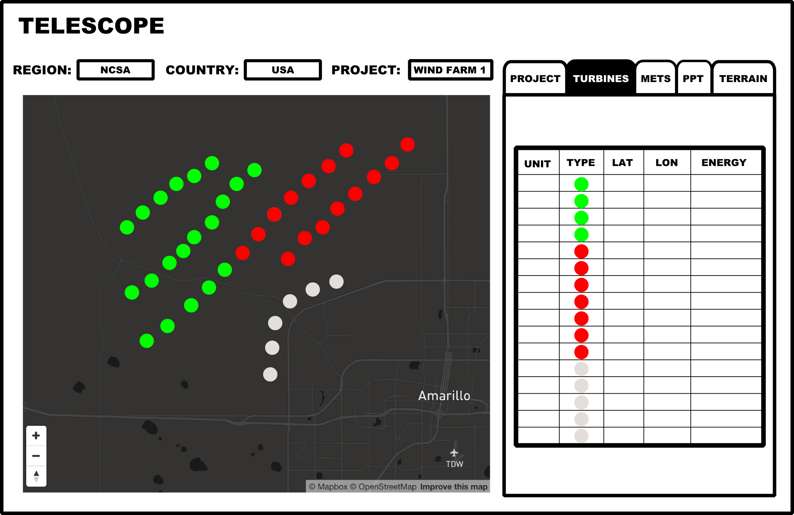
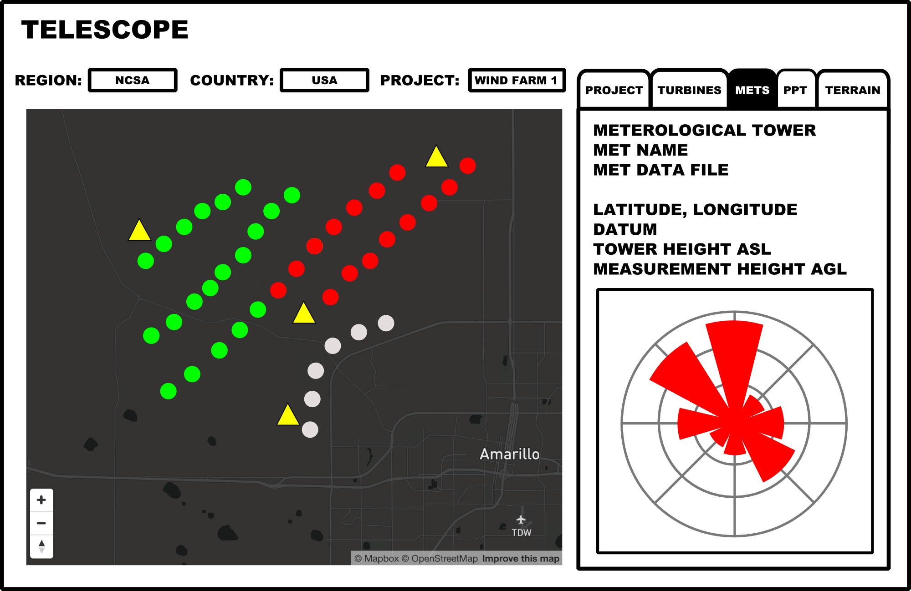
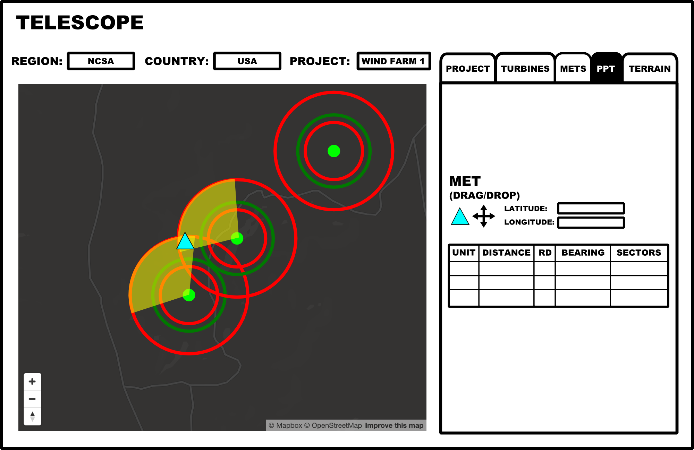
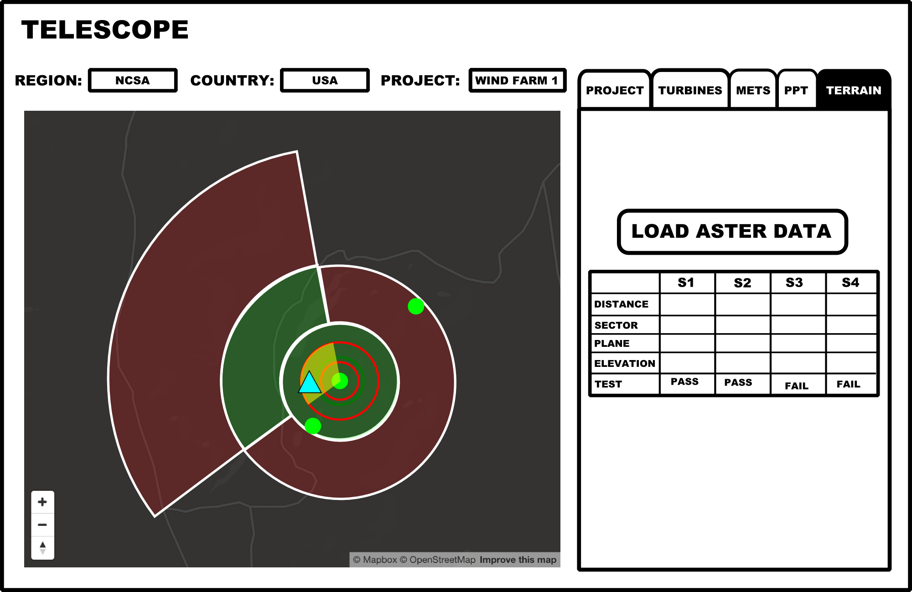

# web-tool-telescope

<h1>Introduction</h1>

Telescope was a web-tool used to access and analyze data related to the development of a wind farm, specifically aspects of power performance testing of wind turbines related to the international standard IEC 61400-12-1. It allowed the user to review the geographical layout of a wind farm and provided interactive features for selecting optimal locations of test turbines and meteorelogical towers using complex geospatial analysis.

Telescope was an internal web-tool I developed in the wind industry a couple of years ago and is probably still the most complex technical web development project I've worked on to date. It was the culmination of my earliest experimentation with web development, and the most complex in a series of web tools I developed to support techanical support and sales at an international wind turbine manufacturing company. 

<h1>Motiviation</h1>

The primary motivation for building this tool was to provide (1) increased knowledge sharing of technical data across multiple groups around the world and (2) an efficienct process for a technical analysis that had previously been done manually. This tool relied upon another internally developed, proprietary desktop client program that was used by analytics teams globally to track and analyze wind farm layout information. Any information that was entered and/or processed by the desktop client program was stored in a centralized database allowing for other users around the globe (with the same client program) to access the information and work seamlessly across projects. 

I'm still incredibly proud of this project and it represents some of my most valued professional strengths: identifying issues with efficiency and knowledge sharing, reverse-engineering systems and figuring out how to use new tools, ...

This write-up covers the five main components of Telescope: Project, Turbines, Mets, PPT and Terrain. In the following sections, I'll provide a brief write-up of each component, both in terms of functionality and development. No source code is included.

<h1>Main Page</h1>

Telescope was a single-page application with a primary map and a secondary information display area. The front-end was built primarily using HTML/CSS, Javascript, jQuery, underscore, D3 and Leaflet. The back-end was built on a relatively simple structure of Python scripts called via CGI, all running on a Windows IIS web server. Telescope (and other web tools) was hosted on a virtual machine set up by the company's internal IT department but largely configured, operated and monitored by myself.

On web tool loading, a sequence of Python scripts were called to query data from a central application server operated by a team of internal developers in Europe. This initial loading query was used to populate a set of select boxes with lists of wind farm projects and the countries and regions they reside in. After this is done, the loading screen (top image) disappears and the main page (map, select boxes, blank information box, etc) appears.

The user can then select regions or countries, and the map will zoom in to the respective area and show markers on the map for each wind farm project location. Once the user selects a specific project, the project information appears.

<h1>Project</h1>

The Project information page highlights information about the layout of a project. Each project is version controlled by the client software that is used to create the project, updated by the various project developers who work on the project. Each version also includes a number of different layouts that the project developer has created in the client software, to try out different combinations of turbine types, locations, wind farm control features, etc. The user can select through the different project versions and layouts, and the information associated with these specific layouts is then presented on the page. Additionally, the user can click on the turbine markers to see detailed meta data about the selected wind turbine.

This information includes the following:
<ul>
<li>Map markers for each turbine location, both new turbines (green) and older turbines (red).</li>
<li>Project coordinates.</li>
<li>Select boxes of project versions and layouts.</li>
<li>A button to export the selected project version/layout to a Google Earth KML file, downloaded in the browser.</li>
<li>Details specific to the layout, such as number of turbines, measured wind conditions, expected production output, etc.</li>
<li>Contact information for the project developer, including a photo and hotlinks for emails with pre-populated subject lines and for instant messenging.</li>
</ul>

When a specific project version and layout has been selected, the user can then select through the navigation tabs to use different components of Telescope, including the Turbine tab.

<h1>Turbines</h1>

The Turbines page is a tabulation of the wind turbines in the selected project version and layout. The table includes all new turbines that will be built in the new project, and any existing turbines that are included in the layout for analysis purposes such as wake studies. Each row is a separate turbine, and includes the wind turbine type, the turbine pad number, latitude/longitude, estimated wind speed average, expected energy output, and other turbine-specific data points.

<h1>Mets</h1>

The Mets page is intended to focus on the meterological towers that have been used in the measurement campaignment of the project development process. Typically, the measurement campaign consists of measuring environmental data (wind speed, direction, temperature, etc) at multiple points at the expected location of wind farm, and often lasts anywhere between 6 months and a year.

All of the meteorogical towers at the project are shown on the map as yellow triangle markers. Clicking on a met marker on the map will populate the information box with information such as met reference name, the data file that contains the summarized met data, met tower coordinates, the height of the met tower above sea level, and the height of the primary sensor measurements.

Additionally, when a met tower is selected, a rose chart is generated highlighting the summarized wind measurements for that met tower, aka a wind rose. This wind rose includes information summarized by wind direction, such as wind speed frequency, expected energy, and Weibull parameter distribution.

<h1>PPT</h1>

Without going into too much detail, a power performance test (PPT) is a test that measures the expected power output of a wind turbine for any given wind speed input, also known as the turbine's power curve. A PPT is used to validate a power performance warranty which is a contractual obligation in most wind turbine purchase agreements. It basically proves to a buyer (or wind farm operator) that the turbines they purchased will satisfy the performance specifications they were sold, and which were used in project financing (performance over time equals money). 

The PPT is performed according to an international standard, IEC 61400-12-1. This standard specifies certain requirements for the following:
<ul>
<li>How to setup the test campaign</li>
<li>Where to put a met tower</li>
<li>How far away a met tower can be from a turbine</li>
<li>How to measure the wind speed</li>
<li>How to measure the turbine output power</li>
<li>Methods for calculating the results</li>
<li>And so many more specifications</li>

The PPT page provides a unique functionality in wind farm analysis tools, and was the main motivation in the development of Telescope in general. It allows the user to dynamically and interactively design a PPT, including selection of nominated turbines for testing and location of the PPT met tower, all according to the IEC 61400-12-1 requirements.  

In this page, the user would visually scan the project layout and identify potential test turbines based on certain criteria and their professional experience. Zooming in on these turbines, the user can then click on the turbine markers to show different colored rings around each turbine. These rings highlight certain distances that are useful in PPT setup, known as D's, where a D is the selected turbine's rotor diameter. Three rings are shown, 2D (red), 2.5D (green) and 4D (red), which represent the minimum distance between the test turbine and a met tower, the recommend distance, and the maximum distance , respectively. By highlighting these rings, the user can identify areas which they should locate a met tower for PPT testing. If multiple turbines are highlighted, the user can find locations where a single met tower could be used to test multiple turbines.

After one or more turbines have been highlighted, the user can drag and drop the blue triangle marker from the information box on the right onto the map on the left. They can dynamically drag and drop this met marker around the map, trying out different possible locations for the met tower. Each time the marker is relocated on the map, valid measurement sectors are recalculated dynamically and can be highlighted on the map by click on the turbine markers again, shown as transparent yellow arc sectors. These valid measurement sectors are the direction from which wind measurements during the test will be allowed, representing uninterrupted, freestream wind. These sectors are calculated according to the IEC 61400-12-1 and involve fairly complex trigonometry, all calculated in the browser in real-time. 

As the user dynamically adjusts the PPT met tower location, a table update to show the allowable PPT test turbines and information about the relationship between the met tower and the test turbine, such as distance between them, in meters and rotor diameters, the bearing angle between them, and the valid measurement sectors. The valid measurement sectors can also be manually edited in the table, to restrict further as needed, and these edits will be reflected in an update to the yellow sectors in the map. 

All of the functionality on this page, such as the drag and drop marker, the rings, and the arc sectors were implemented using a combination of Leaflet and D3 functions, all fed by the results of complex geospatial calculations performed in Javascript. 

<h1>Terrain</h1>

